# 📊 مخطط قاعدة البيانات - AMAN ERP (ERD)

> **آخر تحديث:** فبراير 2026  
> **إجمالي الجداول:** 178+  
> **النوع:** Multi-Tenant — قاعدة بيانات منفصلة لكل شركة (`aman_{company_id}`)

---

## الهيكل العام

```
PostgreSQL Server
├── aman_system          ← جدول الشركات وسجل النشاط
│   ├── system_companies
│   └── system_activity_log
│
├── aman_{company_id_1}  ← بيانات الشركة الأولى (178+ جدول)
├── aman_{company_id_2}  ← بيانات الشركة الثانية
└── ...
```

---

## ERD — العلاقات الرئيسية

```mermaid
erDiagram
    %% ══════════════════════════════════════════════
    %% CORE — المستخدمون والفروع
    %% ══════════════════════════════════════════════
    company_users ||--o{ user_branches : "ينتمي لفروع"
    branches ||--o{ user_branches : "يحتوي مستخدمين"
    company_users {
        int id PK
        varchar username UK
        varchar password
        varchar email UK
        varchar full_name
        varchar role
        jsonb permissions
        boolean is_active
    }
    branches {
        int id PK
        varchar branch_code UK
        varchar branch_name
        varchar branch_type
        boolean is_default
    }

    %% ══════════════════════════════════════════════
    %% ACCOUNTING — المحاسبة
    %% ══════════════════════════════════════════════
    accounts ||--o{ journal_lines : "حساب القيد"
    accounts ||--o{ accounts : "حساب أب"
    journal_entries ||--o{ journal_lines : "بنود القيد"
    fiscal_years ||--o{ fiscal_periods : "فترات السنة"
    cost_centers ||--o{ journal_lines : "مركز تكلفة"

    accounts {
        int id PK
        varchar account_code UK
        varchar account_name
        varchar account_name_en
        varchar account_type
        int parent_id FK
        boolean is_active
        int level
    }
    journal_entries {
        int id PK
        varchar entry_number UK
        date entry_date
        varchar description
        varchar entry_type
        varchar status
        decimal total_debit
        decimal total_credit
        int branch_id FK
    }
    journal_lines {
        int id PK
        int entry_id FK
        int account_id FK
        decimal debit
        decimal credit
        varchar description
        int cost_center_id FK
        varchar currency
    }
    fiscal_years {
        int id PK
        varchar name
        date start_date
        date end_date
        varchar status
    }
    cost_centers {
        int id PK
        varchar code UK
        varchar name
        int parent_id FK
        boolean is_active
    }

    %% ══════════════════════════════════════════════
    %% SALES — المبيعات
    %% ══════════════════════════════════════════════
    customers ||--o{ invoices : "فواتير العميل"
    customers ||--o{ sales_orders : "أوامر البيع"
    customers ||--o{ quotations : "عروض الأسعار"
    invoices ||--o{ invoice_items : "بنود الفاتورة"
    sales_orders ||--o{ sales_order_lines : "بنود أمر البيع"
    products ||--o{ invoice_items : "المنتج"
    products ||--o{ sales_order_lines : "المنتج"

    customers {
        int id PK
        varchar customer_code UK
        varchar name
        varchar tax_number
        varchar phone
        varchar email
        decimal balance
    }
    invoices {
        int id PK
        varchar invoice_number UK
        varchar invoice_type
        int customer_id FK
        int supplier_id FK
        date invoice_date
        decimal total_amount
        decimal tax_amount
        varchar status
        int branch_id FK
    }
    invoice_items {
        int id PK
        int invoice_id FK
        int product_id FK
        decimal quantity
        decimal unit_price
        decimal tax_rate
        decimal total
    }
    sales_orders {
        int id PK
        varchar order_number UK
        int customer_id FK
        date order_date
        varchar status
        decimal total_amount
    }
    quotations {
        int id PK
        varchar quotation_number UK
        int customer_id FK
        date quotation_date
        date valid_until
        varchar status
    }

    %% ══════════════════════════════════════════════
    %% PURCHASES — المشتريات
    %% ══════════════════════════════════════════════
    suppliers ||--o{ purchase_orders : "أوامر الشراء"
    suppliers ||--o{ invoices : "فواتير المورد"
    purchase_orders ||--o{ purchase_order_lines : "بنود أمر الشراء"
    products ||--o{ purchase_order_lines : "المنتج"

    suppliers {
        int id PK
        varchar supplier_code UK
        varchar name
        varchar tax_number
        varchar phone
        decimal balance
    }
    purchase_orders {
        int id PK
        varchar order_number UK
        int supplier_id FK
        date order_date
        varchar status
        decimal total_amount
    }

    %% ══════════════════════════════════════════════
    %% INVENTORY — المخزون
    %% ══════════════════════════════════════════════
    categories ||--o{ products : "تصنيف المنتج"
    products ||--o{ product_stock : "مخزون المنتج"
    warehouses ||--o{ product_stock : "المستودع"
    products ||--o{ stock_movements : "حركة المنتج"
    warehouses ||--o{ stock_movements : "المستودع"
    products ||--o{ batch_tracking : "دفعات المنتج"

    products {
        int id PK
        varchar sku UK
        varchar name
        varchar product_type
        int category_id FK
        decimal cost_price
        decimal selling_price
        varchar unit
        boolean is_active
    }
    categories {
        int id PK
        varchar name
        int parent_id FK
    }
    warehouses {
        int id PK
        varchar name
        varchar code UK
        varchar warehouse_type
        boolean is_active
    }
    product_stock {
        int id PK
        int product_id FK
        int warehouse_id FK
        decimal quantity
        decimal reserved_qty
    }
    stock_movements {
        int id PK
        int product_id FK
        int warehouse_id FK
        varchar movement_type
        decimal quantity
        varchar reference_type
        int reference_id
    }

    %% ══════════════════════════════════════════════
    %% TREASURY — الخزينة
    %% ══════════════════════════════════════════════
    treasury_accounts ||--o{ treasury_transactions : "معاملات الحساب"
    accounts ||--o{ treasury_accounts : "حساب محاسبي"

    treasury_accounts {
        int id PK
        varchar account_name
        varchar account_type
        int ledger_account_id FK
        decimal balance
        varchar currency
        boolean is_active
    }
    treasury_transactions {
        int id PK
        int account_id FK
        varchar transaction_type
        decimal amount
        varchar description
        date transaction_date
    }

    %% ══════════════════════════════════════════════
    %% HR — الموارد البشرية
    %% ══════════════════════════════════════════════
    departments ||--o{ employees : "قسم الموظف"
    positions ||--o{ employees : "منصب الموظف"
    employees ||--o{ attendance : "حضور الموظف"
    employees ||--o{ leave_requests : "إجازات الموظف"
    employees ||--o{ employee_loans : "قروض الموظف"
    payroll_periods ||--o{ payroll_entries : "فترة الراتب"
    employees ||--o{ payroll_entries : "راتب الموظف"

    employees {
        int id PK
        varchar employee_code UK
        varchar full_name
        int department_id FK
        int position_id FK
        date hire_date
        decimal basic_salary
        varchar status
        int branch_id FK
    }
    departments {
        int id PK
        varchar name
        int manager_id FK
    }
    attendance {
        int id PK
        int employee_id FK
        date attendance_date
        time check_in
        time check_out
        varchar status
    }

    %% ══════════════════════════════════════════════
    %% MANUFACTURING — التصنيع
    %% ══════════════════════════════════════════════
    products ||--o{ manufacturing_boms : "قائمة مواد المنتج"
    manufacturing_boms ||--o{ manufacturing_bom_items : "بنود قائمة المواد"
    manufacturing_boms ||--o{ manufacturing_orders : "أمر إنتاج"
    manufacturing_orders ||--o{ manufacturing_order_materials : "مواد أمر الإنتاج"
    work_centers ||--o{ manufacturing_orders : "مركز العمل"

    manufacturing_boms {
        int id PK
        varchar bom_name
        int product_id FK
        decimal quantity
        varchar status
    }
    manufacturing_orders {
        int id PK
        varchar order_number UK
        int bom_id FK
        int work_center_id FK
        decimal planned_qty
        varchar status
        date start_date
    }
    work_centers {
        int id PK
        varchar name
        varchar code UK
        decimal hourly_cost
        int capacity
    }

    %% ══════════════════════════════════════════════
    %% ASSETS — الأصول الثابتة
    %% ══════════════════════════════════════════════
    accounts ||--o{ fixed_assets : "حساب الأصل"
    fixed_assets ||--o{ asset_depreciation : "إهلاك الأصل"

    fixed_assets {
        int id PK
        varchar asset_code UK
        varchar asset_name
        decimal purchase_cost
        decimal current_value
        varchar depreciation_method
        date purchase_date
        varchar status
    }

    %% ══════════════════════════════════════════════
    %% POS — نقاط البيع
    %% ══════════════════════════════════════════════
    pos_sessions ||--o{ pos_orders : "طلبات الجلسة"
    pos_orders ||--o{ pos_order_items : "بنود الطلب"
    products ||--o{ pos_order_items : "المنتج"

    pos_sessions {
        int id PK
        int user_id FK
        varchar status
        decimal opening_balance
        decimal closing_balance
    }
    pos_orders {
        int id PK
        varchar order_number UK
        int session_id FK
        int customer_id FK
        decimal total_amount
        varchar payment_method
    }
```



---

## توزيع الجداول حسب الوحدة

| الوحدة | عدد الجداول | الجداول الرئيسية |
|--------|------------|-----------------|
| **الأساسيات** | 7 | `company_users`, `branches`, `user_branches`, `roles`, `company_settings`, `activity_log`, `token_blacklist` |
| **المحاسبة** | 8 | `accounts`, `journal_entries`, `journal_lines`, `fiscal_years`, `fiscal_periods`, `cost_centers`, `opening_balances`, `recurring_journal_templates` |
| **الميزانيات** | 2 | `budgets`, `budget_items` |
| **العملات** | 3 | `currencies`, `exchange_rates`, `exchange_rate_history` |
| **المبيعات** | 12 | `customers`, `customer_groups`, `invoices`, `invoice_items`, `sales_orders`, `sales_order_lines`, `quotations`, `quotation_lines`, `sales_returns`, `sales_return_items`, `payment_vouchers`, `credit_notes` |
| **المشتريات** | 8 | `suppliers`, `supplier_groups`, `purchase_orders`, `purchase_order_lines`, `debit_notes`, `rfq`, `rfq_lines`, `rfq_responses` |
| **المخزون** | 15 | `products`, `categories`, `warehouses`, `warehouse_locations`, `product_stock`, `stock_movements`, `stock_transfers`, `stock_transfer_items`, `stock_adjustments`, `stock_adjustment_items`, `price_lists`, `batch_tracking`, `serial_numbers`, `quality_inspections`, `cycle_counts` |
| **الخزينة** | 4 | `treasury_accounts`, `treasury_transactions`, `bank_reconciliation`, `bank_reconciliation_lines` |
| **الشيكات والسندات** | 5 | `checks_receivable`, `checks_payable`, `notes_receivable`, `notes_payable`, `check_endorsements` |
| **الضرائب** | 6 | `tax_rates`, `tax_returns`, `tax_return_lines`, `wht_certificates`, `wht_rates`, `wht_transactions` |
| **الموارد البشرية** | 21 | `employees`, `departments`, `positions`, `attendance`, `leave_requests`, `leave_balances`, `employee_loans`, `loan_installments`, `payroll_periods`, `payroll_entries`, `salary_components`, `employee_salary_components`, `salary_structures`, `overtime_requests`, `gosi_settings`, `employee_gosi` + 5 أخرى |
| **HR متقدم** | 8 | `performance_reviews`, `training_programs`, `training_enrollments`, `violations`, `custody_items`, `leave_carry_over`, `job_openings`, `job_applications` |
| **الأصول** | 5 | `fixed_assets`, `asset_depreciation`, `asset_revaluations`, `asset_insurance`, `asset_maintenance` |
| **التصنيع** | 12 | `work_centers`, `production_routes`, `route_operations`, `manufacturing_boms`, `manufacturing_bom_items`, `manufacturing_orders`, `manufacturing_order_materials`, `manufacturing_job_cards`, `manufacturing_quality_checks`, `equipment`, `maintenance_schedules`, `maintenance_logs` |
| **المشاريع** | 5 | `projects`, `project_tasks`, `project_resources`, `project_expenses`, `timesheets` |
| **المصروفات** | 3 | `expense_claims`, `expense_claim_items`, `expense_categories` |
| **نقاط البيع** | 11 | `pos_sessions`, `pos_orders`, `pos_order_items`, `pos_returns`, `pos_return_items`, `pos_order_payments`, `pos_promotions`, `pos_tables`, `pos_table_orders`, `pos_kitchen_orders`, `pos_loyalty_programs` |
| **العقود** | 2 | `contracts`, `contract_renewals` |
| **CRM** | 5 | `crm_opportunities`, `crm_opportunity_stages`, `crm_tickets`, `crm_ticket_comments`, `crm_leads` |
| **الموافقات** | 3 | `approval_workflows`, `approval_steps`, `approval_requests` |
| **الإشعارات** | 1 | `notifications` |
| **الأمان** | 6 | `api_keys`, `api_key_logs`, `webhooks`, `webhook_logs`, `security_events`, `user_2fa_settings` |
| **أخرى** | 7 | `document_templates`, `document_types`, `email_templates`, `product_attributes`, `product_attribute_values`, `mrp_plans`, `supplier_balances` |

---

## العلاقات الرئيسية (Foreign Keys)

### المحاسبة
| من | إلى | العلاقة |
|----|-----|---------|
| `journal_lines.entry_id` | `journal_entries.id` | بند → قيد |
| `journal_lines.account_id` | `accounts.id` | بند → حساب |
| `journal_lines.cost_center_id` | `cost_centers.id` | بند → مركز تكلفة |
| `accounts.parent_id` | `accounts.id` | حساب فرعي → حساب أب (شجرة) |
| `fiscal_periods.fiscal_year_id` | `fiscal_years.id` | فترة → سنة مالية |

### المبيعات والمشتريات
| من | إلى | العلاقة |
|----|-----|---------|
| `invoices.customer_id` | `customers.id` | فاتورة → عميل |
| `invoices.supplier_id` | `suppliers.id` | فاتورة → مورد |
| `invoice_items.invoice_id` | `invoices.id` | بند → فاتورة |
| `invoice_items.product_id` | `products.id` | بند → منتج |
| `sales_orders.customer_id` | `customers.id` | أمر بيع → عميل |
| `purchase_orders.supplier_id` | `suppliers.id` | أمر شراء → مورد |
| `quotations.customer_id` | `customers.id` | عرض سعر → عميل |

### المخزون
| من | إلى | العلاقة |
|----|-----|---------|
| `products.category_id` | `categories.id` | منتج → تصنيف |
| `product_stock.product_id` | `products.id` | مخزون → منتج |
| `product_stock.warehouse_id` | `warehouses.id` | مخزون → مستودع |
| `stock_movements.product_id` | `products.id` | حركة → منتج |
| `stock_movements.warehouse_id` | `warehouses.id` | حركة → مستودع |
| `batch_tracking.product_id` | `products.id` | دفعة → منتج |

### الموارد البشرية
| من | إلى | العلاقة |
|----|-----|---------|
| `employees.department_id` | `departments.id` | موظف → قسم |
| `employees.position_id` | `positions.id` | موظف → منصب |
| `attendance.employee_id` | `employees.id` ON DELETE CASCADE | حضور → موظف |
| `leave_requests.employee_id` | `employees.id` ON DELETE CASCADE | إجازة → موظف |
| `employee_loans.employee_id` | `employees.id` ON DELETE CASCADE | قرض → موظف |
| `payroll_entries.employee_id` | `employees.id` | راتب → موظف |

### التصنيع
| من | إلى | العلاقة |
|----|-----|---------|
| `manufacturing_boms.product_id` | `products.id` | BOM → منتج نهائي |
| `manufacturing_bom_items.bom_id` | `manufacturing_boms.id` | بند BOM → BOM |
| `manufacturing_bom_items.product_id` | `products.id` | بند BOM → مادة خام |
| `manufacturing_orders.bom_id` | `manufacturing_boms.id` | أمر إنتاج → BOM |
| `manufacturing_orders.work_center_id` | `work_centers.id` | أمر إنتاج → مركز عمل |

### الخزينة
| من | إلى | العلاقة |
|----|-----|---------|
| `treasury_accounts.ledger_account_id` | `accounts.id` | حساب خزينة → حساب محاسبي |
| `treasury_transactions.account_id` | `treasury_accounts.id` | معاملة → حساب |

---

## Indexes الأداء المُطبَّقة

### Composite Indexes (22)
| الجدول | الأعمدة | الغرض |
|--------|---------|-------|
| `journal_entries` | `(status, entry_date)` | فلترة القيود بالتاريخ والحالة |
| `journal_lines` | `(account_id, entry_id)` | استعلامات كشف حساب |
| `invoices` | `(customer_id, status)` | فواتير عميل بحالة محددة |
| `invoices` | `(supplier_id, status)` | فواتير مورد بحالة محددة |
| `invoices` | `(invoice_date, invoice_type)` | تقارير بالتاريخ |
| `product_stock` | `(product_id, warehouse_id)` | استعلامات المخزون |
| `stock_movements` | `(product_id, created_at)` | حركات منتج بالتاريخ |
| `attendance` | `(employee_id, attendance_date)` | حضور موظف |
| ... | | و14 آخرين |

### pg_trgm GIN Indexes (11)
| الجدول | العمود | الغرض |
|--------|--------|-------|
| `customers` | `name` | بحث نصي سريع عن العملاء |
| `suppliers` | `name` | بحث نصي سريع عن الموردين |
| `products` | `name` | بحث نصي سريع عن المنتجات |
| `products` | `sku` | بحث بالرمز |
| `employees` | `full_name` | بحث عن موظفين |
| `accounts` | `account_name` | بحث عن حسابات |
| `journal_entries` | `description` | بحث في وصف القيود |
| `projects` | `name` | بحث عن مشاريع |
